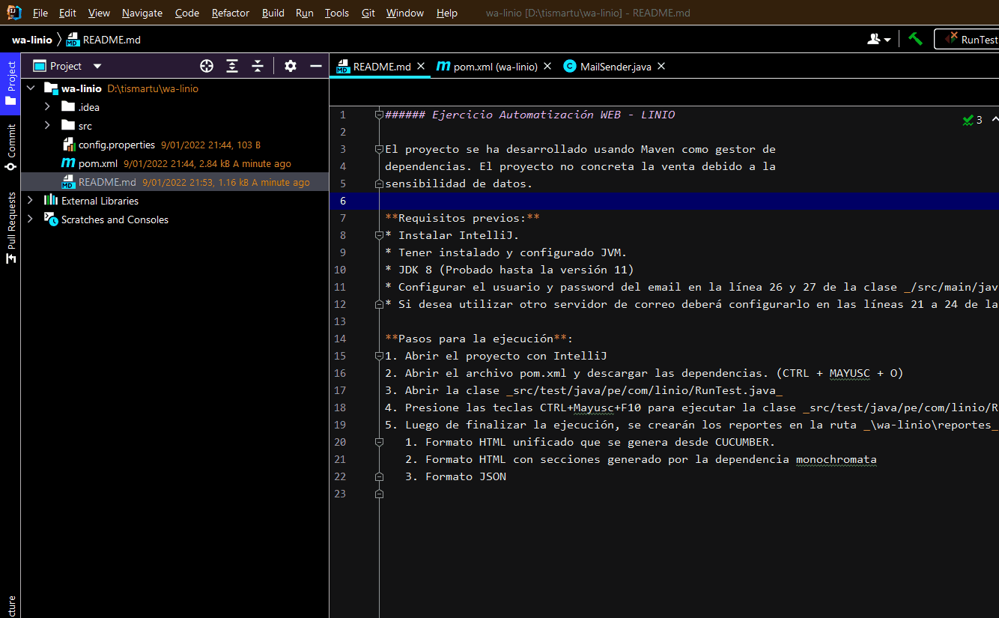

###### Ejercicio Automatización KarateDSL: Petstore Swagger

El proyecto se ha desarrollado usando Maven como gestor de dependencias.

**Requisitos previos:**
* Instalar IntelliJ.
* Tener instalado y configurado JVM.
* SDK 8

**Pasos para la ejecución**:
1. Abrir el proyecto con IntelliJ
2. Abrir el archivo pom.xml y descargar las dependencias. (CTRL + MAYUSC + O)
3. Abrir la clase _src/test/java/swagger/RunnerPetstore.java_
4. Presione las teclas CTRL+Mayusc+F10 para ejecutar la clase _src/test/java/swagger/RunnerPetstore.java_
5. Luego de finalizar la ejecución, se crearán los reportes en la ruta _\test-api\target_:
    1. target/cucumber-html-reports
    3. target/surefire-reports

NOTA: Antes de ejecutar, verifica que el proyecto usará el SDK 1.8
Imagen
